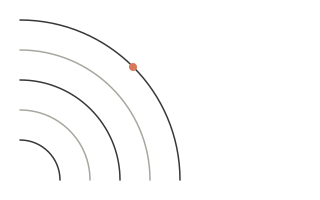
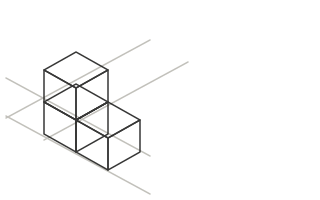

# BINDWELL - integration contract

Foundation built by agent 1. Agents 2 and 3 copy from this file verbatim.
Design authority is `DESIGN-C.md`; this file is its implementation surface.

Files in place:

```
site/
  index.html          built (marketplace home)
  css/main.css        built (complete design system, do not fork)
  js/data.js          built (12-course catalog + render helpers, source of truth)
  js/main.js          built (cart, nav, search, accordion, reveals, course grids)
  js/scene.js         built (Three.js wireframe viewports, restyled for cream)
  js/vendor/          vendored Three.js v0.185.1, no CDN
  img/motif-*.svg     4 category thumbnail motifs
  CONTRACT.md         this file
```

Pages still to build (link to them by exactly these names):

| Page | Owner | Wireframe |
|---|---|---|
| `courses.html` | agent 2 | DESIGN-C 6.2 |
| `course.html` | agent 2 | DESIGN-C 6.3 |
| `pricing.html` | agent 3 | DESIGN-C 6.4 |
| `checkout.html` | agent 3 | DESIGN-C 6.5 |

**`css/catalog.css`, `css/commerce.css`, `js/catalog.js`, `js/course.js`,
`js/checkout.js` still exist on disk from the old dark build. They reference
tokens that no longer exist (`--surface`, `--text-1`, `--line`, `--s-32`,
`--dur-hero`). Rewrite or delete them; do not leave them linked as they are.
`css/scene.css` was removed: the viewport styles now live in `main.css`
section 21.**

---

## 0. Non-negotiables

1. **Every path is relative.** `href="courses.html"`, `src="js/main.js"`.
   A URL must never begin with `/`. The site deploys under a subpath.
2. **No new shared CSS/JS.** Shared components go in `css/main.css` in the
   matching numbered section and get documented here. A page may add one
   page-scoped CSS/JS file if it genuinely needs page-only code; it must use
   the tokens in section 1 of `main.css` and must not redefine a component.
3. **No inline `style=`** except the one sanctioned case: `style="--star-fill:
   96%"` on `.stars` (a fractional rating cannot be a static class).
4. **No CDN except Google Fonts.** No frameworks, no build step.
5. **No Anthropic or Claude names, logos, or UI imitation. No real company or
   real person.** Bindwell branding only. The wordmark is lowercase
   `bindwell.` with a coral period, always.
6. **Every page's footer contains the string "A fictional demo site."**
7. **Banned, grep before you finish:** `#000`, cold grays (`#333/#666/#999`),
   any hex not in section 1's token table, dark sections, em-dash `—`,
   en-dash `–`, emoji, gradients, backdrop-blur, a third shadow value, an
   off-scale radius, strike-through was-prices, countdown timers, "only N
   left", uppercase-tracked eyebrows, mono-font data styling, photos as
   thumbnails or avatars, a second accent hue, star-fill animation,
   count-up numbers, parallax, `transition: all`.
8. **Serif (`Source Serif 4`) is rationed** to: `.display`, `.h1`, `.h2`,
   `.quote__body` / `.quote-type`, `.wordmark`, and the two decorative uses
   (`.thumb__initial`, `.avatar`). Serif inside a card body, a button, a
   price or a meta row is a bug. Everything else is Inter.
9. **Middle dot `·` only inside meta rows.** Never in headlines or prose.
10. **One `<h1>` per page.** Button labels are 3 words or fewer, sentence
    case, one label per intent per page.
11. **Badge rationing is fixed by the data:** 3 Bestseller, 1 New, across the
    whole catalog. Never add a badge that `data.js` does not carry, never
    render two badges on one card.

---

## 1. Design tokens

Declared on `:root` in `css/main.css`. Use the variable, never the literal.

| Token | Value | Use |
|---|---|---|
| `--paper` | `#FAF9F5` | Page background |
| `--paper-tint` | `#F0EEE6` | Tinted sections, thumbnail base, avatars |
| `--card` | `#FFFFFF` | Cards, nav, inputs, accordion |
| `--ink` | `#141413` | Primary text, prices, icons |
| `--ink-2` | `#6E6D66` | Secondary text, meta, instructor names |
| `--ink-3` | `#A8A69E` | Placeholder + disabled only. Never readable text. |
| `--hairline` | `#E5E3DA` | All 1px borders |
| `--hairline-strong` | `#D6D3C6` | Hover/focus borders, empty stars |
| `--accent` | `#D97757` | Primary buttons, active chips, stars, wordmark dot, focus ring |
| `--accent-hover` | `#BD5D3A` | Primary hover, coral text at body size |
| `--accent-tint` | `#FBF0EA` | Active chip fill, New badge, Design thumbnail |
| `--star` | `#D97757` | Star fill |
| `--sage` | `#788C7F` | Check icons, live dot |
| `--sage-deep` | `#5C7265` | Bestseller badge text, success text |
| `--sage-tint` | `#EEF2EF` | Bestseller badge fill, success banner, Data thumbnail |
| `--error` | `#B04A33` | Form error text and error borders only |
| `--focus` | `#D97757` | Focus ring |
| `--thumb-career` | `#F5F1E8` | Product & Career thumbnail plate only |

Spacing `--s-4 … --s-96` (4, 8, 12, 16, 24, 32, 48, 64, 96). Radius
`--r-card` 12, `--r-ctl` 8, `--r-chip` 999, `--r-badge` 6. Shadows
`--shadow-1` (resting) and `--shadow-2` (hover). Motion `--ease-out`,
`--ease-drawer`, `--dur-press` 100, `--dur-fast` 150, `--dur-card` 180,
`--dur-panel` 200, `--dur-hero` 220, `--dur-drawer` 240.

Layout: `--container` 1280, `--pad-x` 24 (16 under 640), `--nav-h` 72,
`--sticky-top` 88.

**Breakpoints: 640 / 768 / 1024 / 1280.** Card grids 4-up ≥1024, 2-up ≥640,
1-up below. Mobile nav under 768. Sticky sidebar becomes a bottom bar under
1024. Two-up field grids collapse under 640.

Contrast rules that matter: white-on-coral only on 48px/40px primary buttons
at 16px semibold. Body-size coral text uses `--accent-hover`, never
`--accent`. `--ink-2` is never used on anything darker than `--paper-tint`.

---

## 2. Shared `<head>`

Copy exactly. Only `<title>`, the description, and the page-script lines
change.

```html
<!doctype html>
<html lang="en">
<head>
<meta charset="utf-8">
<meta name="viewport" content="width=device-width, initial-scale=1">
<title>Bindwell - Catalog</title>
<meta name="description" content="One sentence, plain, no marketing verbs.">
<script>document.documentElement.className += " has-js";</script>
<link rel="preconnect" href="https://fonts.googleapis.com">
<link rel="preconnect" href="https://fonts.gstatic.com" crossorigin>
<link rel="stylesheet" href="https://fonts.googleapis.com/css2?family=Source+Serif+4:opsz,wght@8..60,500;8..60,600&family=Inter:wght@400;500;600&display=swap">
<link rel="stylesheet" href="css/main.css">
<script src="js/data.js" defer></script>
<script src="js/main.js" defer></script>
</head>
```

`js/data.js` must load **before** `js/main.js`; a page script loads after
both. The inline `has-js` line is required: it gates reveal states so they
do not flash. Do not add other inline JS.

Titles: `Bindwell - Catalog`, `Bindwell - Interface Motion` (course title),
`Bindwell - Pricing`, `Bindwell - Checkout`.

`course.html` additionally loads the 3D engine:

```html
<script type="module" src="js/scene.js"></script>
```

## 3. Page skeleton

```html
<body>
<a class="skip-link" href="#main">Skip to content</a>

<!-- NAV (section 4) -->
<div class="nav__backdrop" data-nav-backdrop></div>

<main id="main">
  <section class="section">
    <div class="container"> ... </div>
  </section>
</main>

<!-- FOOTER (section 5) -->
</body>
</html>
```

`.section` supplies 64px vertical padding (48 under 768). `.container`
supplies the 1280 max-width and side padding. Sections do not draw
dividers; the tint change on `.section--tint` is the only separation.
Modifiers: `.section--tight` (48/48), `.section--flush-top` (no top
padding), `.section--tint` (full-bleed `--paper-tint`; put the tint on the
`<section>`, the content stays in `.container`).

---

## 4. Canonical nav

### 4.1 Full nav (courses.html, course.html, pricing.html)

Copy verbatim. On the current page add `aria-current="page"` to that link.
The mobile search row and panel ship with it, in this order, always.

```html
<header class="nav">
  <div class="container nav__inner">
    <a class="wordmark" href="index.html">bindwell<span class="wordmark__dot">.</span></a>

    <nav class="nav__links" aria-label="Primary">
      <a class="nav__link" href="courses.html">Courses</a>
    </nav>

    <form class="search nav__search" role="search" action="courses.html" method="get" data-search-form>
      <svg class="icon search__icon" viewBox="0 0 20 20" aria-hidden="true"><circle cx="9" cy="9" r="6"></circle><path d="M13.5 13.5 17.5 17.5"></path></svg>
      <input class="search__input" type="search" name="q" aria-label="Search courses" placeholder="Search courses">
    </form>

    <div class="nav__actions">
      <a class="nav__link nav__signin" href="pricing.html">Pricing</a>
      <button class="nav__search-toggle" type="button" aria-label="Search" aria-expanded="false" aria-controls="nav-search-row" data-search-toggle>
        <svg class="icon" viewBox="0 0 20 20" aria-hidden="true"><circle cx="9" cy="9" r="6"></circle><path d="M13.5 13.5 17.5 17.5"></path></svg>
      </button>
      <a class="nav__cart" href="checkout.html" aria-label="Cart">
        <svg class="icon icon--lg" viewBox="0 0 24 24" aria-hidden="true"><path d="M3 4h2l2.2 10.5h10.2"></path><path d="M6.6 7h14l-1.6 6.5H7.4"></path><circle cx="9.5" cy="19" r="1.4"></circle><circle cx="17.5" cy="19" r="1.4"></circle></svg>
        <span class="nav__cart-count" data-cart-count hidden>0</span>
      </a>
      <a class="btn btn--primary btn--sm nav__signin" href="#">Sign in</a>
      <button class="nav__toggle" type="button" aria-label="Menu" aria-expanded="false" aria-controls="nav-panel" data-nav-toggle>
        <svg class="icon icon--open icon--lg" viewBox="0 0 24 24" aria-hidden="true"><path d="M4 7h16M4 12h16M4 17h16"></path></svg>
        <svg class="icon icon--close icon--lg" viewBox="0 0 24 24" aria-hidden="true"><path d="M6 6 18 18M18 6 6 18"></path></svg>
      </button>
    </div>
  </div>

  <div class="nav__mobile-search" id="nav-search-row" data-search-row>
    <div>
      <div class="container">
        <form class="search" role="search" action="courses.html" method="get" data-search-form>
          <svg class="icon search__icon" viewBox="0 0 20 20" aria-hidden="true"><circle cx="9" cy="9" r="6"></circle><path d="M13.5 13.5 17.5 17.5"></path></svg>
          <input class="search__input" type="search" name="q" aria-label="Search courses" placeholder="Search courses">
        </form>
      </div>
    </div>
  </div>

  <div class="nav__panel" id="nav-panel" data-nav-panel>
    <a class="nav__panel-link" href="courses.html">Courses</a>
    <a class="nav__panel-link" href="pricing.html">Pricing</a>
    <a class="nav__panel-link" href="checkout.html">Cart</a>
    <div class="nav__panel-actions">
      <a class="btn btn--primary btn--block" href="#">Sign in</a>
    </div>
  </div>
</header>
<div class="nav__backdrop" data-nav-backdrop></div>
```

Everything in it is wired by `main.js`: the hamburger, the mobile search
expander, Escape, and the backdrop click. Nothing to hook up.

### 4.2 Reduced nav (checkout.html only)

72px, no links, no search, no cart icon.

```html
<header class="nav">
  <div class="container nav__inner">
    <a class="wordmark" href="index.html">bindwell<span class="wordmark__dot">.</span></a>
    <span class="nav__status">Secure checkout</span>
  </div>
</header>
```

---

## 5. Canonical footer

### 5.1 Full footer (courses.html, course.html, pricing.html)

```html
<footer class="footer">
  <div class="container footer__grid">
    <div class="footer__brand">
      <a class="wordmark" href="index.html">bindwell<span class="wordmark__dot">.</span></a>
      <p class="body-sm t-2">Well-made courses, taught by people who still do the work.</p>
      <p class="meta">&copy; 2026 Bindwell &middot; A fictional demo site.</p>
    </div>

    <div class="footer__col">
      <span class="footer__title">Explore</span>
      <ul class="footer__list">
        <li><a class="footer__link" href="courses.html">All courses</a></li>
        <li><a class="footer__link" href="courses.html?cat=engineering">Engineering</a></li>
        <li><a class="footer__link" href="courses.html?cat=design">Design</a></li>
        <li><a class="footer__link" href="courses.html?cat=data">Data &amp; AI</a></li>
        <li><a class="footer__link" href="courses.html?cat=career">Product &amp; Career</a></li>
        <li><a class="footer__link" href="pricing.html">Pricing</a></li>
      </ul>
    </div>

    <div class="footer__col">
      <span class="footer__title">Company</span>
      <ul class="footer__list">
        <li><a class="footer__link" href="#">About</a></li>
        <li><a class="footer__link" href="#">Instructors</a></li>
        <li><a class="footer__link" href="#">Contact</a></li>
      </ul>
    </div>

    <div class="footer__col">
      <span class="footer__title">Support</span>
      <ul class="footer__list">
        <li><a class="footer__link" href="#">Refunds</a></li>
        <li><a class="footer__link" href="#">Terms</a></li>
        <li><a class="footer__link" href="#">Privacy</a></li>
      </ul>
    </div>
  </div>
</footer>
```

`href="#"` marks a destination that does not exist in this demo. Do not
invent pages. No newsletter form, no social row, no payment-method icons.

### 5.2 Reduced footer (checkout.html only)

```html
<footer class="footer footer--reduced">
  <div class="container footer__row">
    <p class="meta">&copy; 2026 Bindwell &middot; A fictional demo site.</p>
    <p class="meta"><a class="footer__link" href="#">Terms</a> <a class="footer__link" href="#">Privacy</a></p>
  </div>
</footer>
```

---

## 6. URL conventions

| URL | Meaning |
|---|---|
| `course.html?c=CODE` | Course detail. Unknown or missing code falls back to `TL-301`. Every course link on the site uses this form. |
| `courses.html?q=TERM` | Catalog filtered by free text against title + instructor + category. Empty or absent `q` shows everything. |
| `courses.html?cat=SLUG` | Catalog pre-filtered to a category. Slugs: `engineering`, `design`, `data`, `career`. Nav, hero chips and the footer already link this way. |
| `courses.html?format=cohort` | Optional; used by the pricing page's "See cohort courses" link. Agent 2 should honour it if cheap. |
| `checkout.html` | Cart + mock payment. |

`?q` and `?cat` may combine. Reading them is agent 2's job; the links exist
already.

---

## 7. Catalog data: `js/data.js`

Twelve courses, fictional throughout. **Never hard-code a title, price,
rating or instructor into a page.** Read it from here.

### 7.1 Globals

```js
window.BINDWELL_COURSES     // array of 12 course objects, display order
window.BINDWELL_CATEGORIES  // [{name:"Engineering", slug:"engineering"}, ...]
window.BINDWELL_REVIEWS     // pool of 6 fictional reviews
window.BINDWELL_DATA        // the helper object below
```

### 7.2 Course object

```js
{
  code: "TL-204",                     // cart entry and ?c= value
  title: "Interface Motion",
  category: "Design",                 // one of the 4 names
  slug: "design",                     // thumbnail + ?cat= key
  instructor: "Anneke Visser",
  instructorCred: "Design engineer; shipped three widely used ...",
  instructorBio: "Two to three sentences.",
  rating: 4.8,                        // number, one decimal
  reviews: 3204,                      // number, format with formatCount()
  learners: 27910,
  hours: 8.5,                         // number, or null for cohort courses
  length: "8.5h",                     // display string, cohorts: "8 weeks, 16 live sessions"
  lengthLong: "8.5h video",
  level: "Intermediate",              // Beginner | Intermediate | Advanced | All levels
  format: "Self-paced",               // Self-paced | Cohort
  price: 69,                          // number
  priceCents: 6900,
  badge: "Bestseller",                // "Bestseller" | "New" | null
  updated: "Updated March 2026",
  desc: "The one-liner (standfirst on the detail page).",
  bullets: [ /* 5 strings, the "What you'll learn" list */ ],
  requirements: [ /* 2-3 strings */ ],
  syllabus: [
    { title: "The animation decision framework", lessons: 5, minutes: 90 },
    /* cohort courses instead: { title: "Type checking", weekly: "Weeks 3-4" } */
  ]
}
```

Codes, in display order: `TL-112, TL-301, TL-410, TL-204, TL-317, BW-118,
BW-210, BW-224, BW-305, TL-405, BW-402, BW-260`.

### 7.3 Helpers on `window.BINDWELL_DATA`

```js
byCode("tl-204")             // course object or null (case-insensitive, trimmed)
resolveCode(raw)             // valid CODE string, or "TL-301"
courseFromQuery()            // course object from ?c=, TL-301 fallback
inCategory("Design")         // array of courses
DEFAULT_CODE                 // "TL-301"

formatPrice(69)              // "$69"
formatMoney(69)              // "$69.00"     (checkout totals)
formatCount(3204)            // "3,204"
formatDuration(90)           // "1h 30m"
initials("Anneke Visser")    // "AV"         (avatars)
escapeHtml(str)
slugFor("Data & AI")         // "data"

thumbClass(category)         // "thumb thumb--design"
thumbSrc(category)           // "img/motif-design.svg"
thumbMarkup(course, extra)   // full thumbnail element (see section 9)
starMarkup(4.8, "sm", 3204)  // full star display (see section 10)
badgeMarkup("Bestseller")    // <span class="badge badge--bestseller">...
metaLine(course)             // "8.5h · Intermediate"
courseCard(course)           // the entire course card <a> (see section 11)

totalLessons(course)         // 26
curriculumSummary(course)    // "5 sections · 26 lessons · 8.5h total"
pickReviews("TL-204")        // deterministic 3 reviews from the pool
subtotal(["TL-204","BW-224"])// 114  (number)
```

All markup helpers return HTML strings and escape their inputs.

---

## 8. Cart

- **Key:** `tolerance_cart` (kept verbatim for compatibility; never shown to
  users).
- **Value:** JSON array of course-code strings, no duplicates, order
  preserved: `["TL-301","BW-224"]`.
- Nothing else is stored. No prices, no quantities, no user data. Prices are
  looked up from `data.js` at render time.
- Malformed or missing values are treated as `[]`.

Public API on `window.BINDWELL` (call it, do not re-implement it).
`window.TOLERANCE` is kept as a legacy alias; use `BINDWELL` in new code.

```js
BINDWELL.readCart()                 // -> ["TL-301"]
BINDWELL.writeCart(["TL-301"])      // replaces, re-renders the badge, fires the event
BINDWELL.addToCart("TL-301")        // adds if absent
BINDWELL.removeFromCart("TL-301")
BINDWELL.renderCart()               // force badge re-render
BINDWELL.renderCourseGrids()        // re-fill any [data-course-grid] elements
```

Declarative shortcuts, delegated at the document level so controls you
render later are wired automatically:

```html
<button class="btn btn--primary btn--block" type="button" data-add-to-cart="TL-301">Add to cart</button>
<button class="btn btn--ghost btn--danger" type="button" data-remove-from-cart="TL-301">Remove</button>
```

Badge rendering: every `[data-cart-count]` gets `textContent = count` and
`hidden = (count === 0)`. The cart icon itself always shows; only the pill
hides. Keep the `hidden` attribute in your markup.

React to changes with the event, not by polling:

```js
document.addEventListener("bindwell:cart", function (e) {
  e.detail.codes; // ["TL-301","BW-224"]
});
```

It fires on every write, including cross-tab `storage` sync.

---

## 9. Thumbnail system

Four category motifs, line art on a tinted plate, plus a ghosted serif
initial from the course title. No photos, ever.

| Category | slug | Plate | Motif |
|---|---|---|---|
| Engineering | `engineering` | `--paper-tint` | Isometric cube lattice |
| Design | `design` | `--accent-tint` | Concentric quarter-arcs + one coral dot |
| Data & AI | `data` | `--sage-tint` | Node graph, one sage node |
| Product & Career | `career` | `--thumb-career` | Stepped path on ruled lines |

Get it from `BINDWELL_DATA.thumbMarkup(course)`, or write it by hand:

```html
<span class="thumb thumb--design">
  
  <span class="thumb__initial" aria-hidden="true">I</span>
</span>
```

Aspect is 16:10 everywhere. Add `thumb--line` for the 96x64 cart crop, and
`card__thumb` when it sits at the top of a course card (adds the bottom
hairline). The whole thing is decorative: `alt=""` on the image, the card or
row title carries the meaning.

---

## 10. Star display

Static, never an input, never animated. Always accompanied by the numeric
value and count in visible text. Use
`BINDWELL_DATA.starMarkup(rating, "sm"|"md", reviewCount)`.

The fractional fill is honest: a coral row is clipped to `rating/5` over a
`--hairline-strong` row. `--star-fill` is the only inline style permitted
anywhere on the site.

```html
<span class="stars stars--sm" role="img" aria-label="Rated 4.8 out of 5 by 3,204 learners" style="--star-fill:96.00%">
  <svg class="stars__glyphs stars__glyphs--track" viewBox="0 0 100 20" aria-hidden="true">... 5 paths ...</svg>
  <span class="stars__fill">
    <svg class="stars__glyphs stars__glyphs--fill" viewBox="0 0 100 20" aria-hidden="true">... 5 paths ...</svg>
  </span>
</span>
```

Sizes: `stars--sm` 14px (cards, reviews), `stars--md` 18px (detail title row,
review summary).

---

## 11. Component snippets

### 11.1 Course card

Do not hand-write these. One call:

```js
document.getElementById("grid").innerHTML =
  BINDWELL_COURSES.map(BINDWELL_DATA.courseCard).join("");
```

Or declaratively, wired by `main.js` on load:

```html
<div class="grid-cards" data-course-grid="BW-118,BW-224,TL-204,TL-410"></div>
```

The produced markup (for reference; the whole card is one link):

```html
<a class="card" href="course.html?c=TL-204">
  <span class="thumb thumb--design card__thumb"> ... </span>
  <span class="card__body">
    <span class="card__badge"><span class="badge badge--bestseller">Bestseller</span></span>
    <span class="card__title">Interface Motion</span>
    <span class="card__instructor meta">Anneke Visser</span>
    <span class="card__rating">
      <span class="card__score">4.8</span>
      <span class="stars stars--sm" ...> ... </span>
      <span class="meta">(3,204)</span>
    </span>
    <span class="card__meta meta">8.5h · Intermediate</span>
    <span class="card__price price">$69</span>
  </span>
</a>
```

For catalog filtering, wrap each card in `<div class="card-slot">`. Toggle
`.is-fading` (150ms opacity), then `.is-filtered-out` (removes it from
layout). Never animate the container, never add a layout spring.

### 11.2 Buttons

```html
<a class="btn btn--primary" href="courses.html">Browse courses</a>
<a class="btn btn--secondary" href="pricing.html">See pricing</a>
<button class="btn btn--ghost" type="button">Clear search</button>
<button class="btn btn--ghost btn--danger" type="button" data-remove-from-cart="TL-301">Remove</button>
<a class="btn btn--primary btn--sm" href="#">Sign in</a>
<button class="btn btn--primary btn--block" type="submit"> ... </button>

<!-- disabled: attribute on <button>, class on <a> -->
<button class="btn btn--primary" type="button" disabled>Add to cart</button>
<a class="btn btn--secondary is-disabled" href="#" aria-disabled="true">Add to cart</a>
```

Loading. Both spans share one grid cell, so the button never changes width.
Add `.is-loading` to swap them (150ms crossfade). The spinner is the only
keyframe animation on the site.

```html
<button class="btn btn--primary btn--block" type="submit">
  <span class="btn__label">Pay $124</span>
  <span class="btn__loading" aria-hidden="true"><span class="btn__spinner"></span>Working</span>
</button>
```

```js
btn.classList.add("is-loading");
btn.classList.remove("is-loading");
```

Never: gradients, coral outline buttons, two primaries side by side,
icon-only primaries.

### 11.3 Chips

```html
<div class="chip-row" role="group" aria-label="Category">
  <button class="chip" type="button" aria-pressed="true">All</button>
  <button class="chip" type="button" aria-pressed="false">Engineering</button>
</div>
```

`aria-pressed="true"` (or `.is-active`) paints the coral state. One selected
per group. Rows scroll horizontally on mobile and never wrap to 3+ lines.
Category chips that navigate are `<a class="chip" href="courses.html?cat=...">`.

### 11.4 Accordion (curriculum + FAQ, one component)

Wrapper needs `data-accordion`. Items are independent. An item open on load
carries `.is-open` on `.acc__item` **and** `aria-expanded="true"` on the
trigger. The `.acc__panel > .acc__clip > .acc__inner` nesting is required
for the `grid-template-rows` transition; do not flatten it. Ids must be
unique per page.

```html
<div class="acc" data-accordion>
  <div class="acc__item is-open">
    <button class="acc__trigger" type="button" aria-expanded="true" aria-controls="mod-1">
      <span class="acc__title">The animation decision framework</span>
      <span class="acc__right">
        <span class="acc__meta">5 lessons · 1h 30m</span>
        <svg class="icon acc__chevron" viewBox="0 0 20 20" aria-hidden="true"><path d="M5 8l5 5 5-5"></path></svg>
      </span>
    </button>
    <div class="acc__panel" id="mod-1">
      <div class="acc__clip">
        <div class="acc__inner">
          <ul>
            <li class="acc__lesson"><span>Lesson title</span><span>08:40</span></li>
          </ul>
        </div>
      </div>
    </div>
  </div>
</div>
```

FAQ items drop `.acc__meta` and put `<p class="acc__text">` inside
`.acc__inner`. `main.js` handles clicks and makes keyboard toggles instant.

### 11.5 Form field

Helper text is always present in markup; the error line is hidden until the
field gets `.is-error`. Placeholders are format hints, never labels.

```html
<div class="field">
  <label class="field__label" for="card">Card number</label>
  <input class="field__input" id="card" name="card" type="text" inputmode="numeric" placeholder="4242 4242 4242 4242" aria-describedby="card-help">
  <p class="field__help" id="card-help">Mock checkout. No card is charged.</p>
  <p class="field__error">Enter a 16-digit card number.</p>
</div>

<div class="field-grid">
  <div class="field"> ... </div>
  <div class="field"> ... </div>
</div>

<div class="field">
  <label class="field__label" for="country">Country</label>
  <select class="field__select" id="country" name="country">
    <option>United States</option>
  </select>
</div>
```

Error copy is specific ("Enter the 3-digit code on the back of the card."),
never "Invalid input". Validate on submit, then on blur after the first
attempt.

### 11.6 Buy card (course detail sidebar)

```html
<aside class="buy sticky">
  <div class="buy__media">
    <!-- thumbMarkup(course) here, or the 3D viewport for TL-301 / TL-410 -->
  </div>
  <div class="buy__body">
    <div class="buy__price"><span class="price-lg">$69</span></div>
    <button class="btn btn--primary btn--block" type="button" data-add-to-cart="TL-204">Add to cart</button>
    <p class="buy__note" data-buy-note>Added. It'll wait for you.</p>
    <a class="btn btn--secondary btn--block" href="pricing.html">Buy with the plan</a>
    <span class="label">This course includes</span>
    <ul class="buy__list">
      <li class="buy__item"><svg class="icon icon--sm" ...></svg>8.5h of video</li>
    </ul>
    <p class="buy__foot">Prices are demo data.</p>
  </div>
</aside>
```

States: already in cart, swap the primary to `<a class="btn btn--primary
btn--block" href="checkout.html">Go to cart</a>` and add `.is-visible` to
`.buy__note` (150ms fade). No toast. Under 1024 the card renders in flow
(drop `.sticky`) and a `.buybar` is fixed to the bottom:

```html
<div class="buybar">
  <span class="price">$69</span>
  <button class="btn btn--primary btn--sm" type="button" data-add-to-cart="TL-204">Add to cart</button>
</div>
```

### 11.7 Cart line item (checkout)

```html
<div class="panel panel--flush">
  <div class="line">
    <span class="thumb thumb--design thumb--line"> ... </span>
    <span class="line__main">
      <a class="line__title" href="course.html?c=TL-204">Interface Motion</a>
      <span class="meta">Anneke Visser</span>
      <span class="meta">8.5h · Intermediate</span>
    </span>
    <span class="line__side">
      <span class="price">$69</span>
      <button class="btn btn--ghost btn--danger btn--sm" type="button" data-remove-from-cart="TL-204">Remove</button>
    </span>
  </div>
</div>
```

Removal: add `.is-removing` (150ms opacity), then `.is-collapsed` on
`transitionend`.

### 11.8 Order summary

```html
<div class="panel sticky">
  <h3 class="h3">Order summary</h3>
  <div class="summary-row"><span>Interface Motion</span><span>$69.00</span></div>
  <hr>
  <div class="summary-row summary-row--muted"><span>Subtotal</span><span>$69.00</span></div>
  <div class="summary-row summary-row--muted"><span>Tax</span><span>$0.00</span></div>
  <hr>
  <div class="summary-row summary-row--total"><span>Total</span><span>$69.00</span></div>
</div>
```

### 11.9 Plan card (pricing)

```html
<div class="plan plan--featured">
  <h3 class="h3">Personal Plan</h3>
  <div class="plan__price"><span class="price-lg">$18/mo</span><span class="meta">billed yearly at $180</span></div>
  <ul class="check-list">
    <li class="check-list__item"><svg class="icon icon--sm" viewBox="0 0 20 20" aria-hidden="true"><path d="M4 10.5l4 4 8-9"></path></svg>All 10 self-paced courses</li>
  </ul>
  <div class="plan__cta"><a class="btn btn--primary" href="#">Start the plan</a></div>
</div>
```

`.plan--featured` adds the 2px `--accent` top border. That is the only
highlight a plan gets: no badge, no pill, no "most popular".

### 11.10 Testimonial, review, instructor, notice, status, empty state

```html
<figure class="quote">
  <!-- optional stars--sm row -->
  <blockquote class="quote__body">&ldquo;Real typographic quotes only.&rdquo;</blockquote>
  <figcaption class="quote__attr">
    <span class="avatar" aria-hidden="true">DW</span>
    <span><span class="quote__name">Dana Whitfield</span><span class="quote__role">Operations analyst</span></span>
  </figcaption>
</figure>

<article class="review">
  <span class="stars stars--sm" ...> ... </span>
  <p class="review__name">Ingrid Solheim</p>
  <p class="meta">February 2026</p>
  <p class="body-sm t-2">Two to three lines.</p>
</article>

<div class="instructor">
  <span class="avatar avatar--lg" aria-hidden="true">AV</span>
  <div class="instructor__body">
    <h3 class="h3">Anneke Visser</h3>
    <p class="meta">Design engineer; shipped three widely used interaction libraries.</p>
    <p class="body-sm t-2">Bio paragraph.</p>
    <p class="meta">4.8 instructor rating · 2 courses · 46,000 learners</p>
  </div>
</div>

<div class="notice">
  <svg class="icon" viewBox="0 0 20 20" aria-hidden="true"><path d="M4 10.5l4 4 8-9"></path></svg>
  <div class="notice__body">
    <h2 class="h2">You're enrolled.</h2>
    <p class="body-sm">A receipt is on its way to your inbox.</p>
    <a class="btn btn--primary" href="courses.html">Back to the catalog</a>
  </div>
</div>

<p class="status"><span class="status__dot"></span>Next cohorts start in September</p>

<div class="empty">
  <h3 class="h3">Nothing matches that combination.</h3>
  <p class="body-sm t-2">Try removing a filter, or browse everything.</p>
  <a class="btn btn--secondary" href="courses.html">Show all courses</a>
</div>
```

`.status__dot` is the site's single live indicator: only when mock data says
enrollment is open.

### 11.11 Breadcrumb and rating row (course detail)

```html
<nav class="crumbs" aria-label="Breadcrumb">
  <a href="index.html">Home</a><span class="crumbs__sep">/</span>
  <a href="courses.html?cat=design">Design</a><span class="crumbs__sep">/</span>
  <span>Interface Motion</span>
</nav>

<div class="rating-row">
  <span class="rating-row__score">4.8</span>
  <span class="stars stars--md" ...> ... </span>
  <span>(3,204 ratings)</span>
  <span>· 27,910 learners</span>
</div>
```

---

## 12. Icons

One set, 20x20 or 24x24 viewBox, `class="icon"` (`icon--sm` 16,
`icon--lg` 24), `aria-hidden="true"`. `.icon` supplies `fill:none;
stroke:currentColor; stroke-width:1.75; round caps`. Do not import an icon
library and do not draw a fifth style.

```html
<!-- search -->    <svg class="icon" viewBox="0 0 20 20" aria-hidden="true"><circle cx="9" cy="9" r="6"></circle><path d="M13.5 13.5 17.5 17.5"></path></svg>
<!-- chevron -->   <svg class="icon" viewBox="0 0 20 20" aria-hidden="true"><path d="M5 8l5 5 5-5"></path></svg>
<!-- check -->     <svg class="icon" viewBox="0 0 20 20" aria-hidden="true"><path d="M4 10.5l4 4 8-9"></path></svg>
<!-- arrow -->     <svg class="icon" viewBox="0 0 20 20" aria-hidden="true"><path d="M3 10h14"></path><path d="M12 5l5 5-5 5"></path></svg>
<!-- play/video --><svg class="icon" viewBox="0 0 20 20" aria-hidden="true"><circle cx="10" cy="10" r="7"></circle><path d="M8.5 7l4.5 3-4.5 3z"></path></svg>
<!-- list -->      <svg class="icon" viewBox="0 0 20 20" aria-hidden="true"><path d="M7 6h9M7 10h9M7 14h9M4 6h.01M4 10h.01M4 14h.01"></path></svg>
<!-- file -->      <svg class="icon" viewBox="0 0 20 20" aria-hidden="true"><path d="M11 2H5.5A1.5 1.5 0 0 0 4 3.5v13A1.5 1.5 0 0 0 5.5 18h9a1.5 1.5 0 0 0 1.5-1.5V7z"></path><path d="M11 2v5h5"></path></svg>
<!-- refund -->    <svg class="icon" viewBox="0 0 20 20" aria-hidden="true"><path d="M16 7A7 7 0 1 0 16.5 10"></path><path d="M16.5 3v4h-4"></path></svg>
<!-- infinity/lifetime --> <svg class="icon" viewBox="0 0 20 20" aria-hidden="true"><path d="M7 7a3 3 0 1 0 0 6c2 0 3-3 6-3a3 3 0 1 1 0 6c-3 0-4-3-6-3"></path></svg>
<!-- book -->      <svg class="icon" viewBox="0 0 24 24" aria-hidden="true"><path d="M3 5h6a2 2 0 0 1 2 2v12a2 2 0 0 0-2-2H3z"></path><path d="M21 5h-6a2 2 0 0 0-2 2v12a2 2 0 0 1 2-2h6z"></path></svg>
<!-- person -->    <svg class="icon" viewBox="0 0 24 24" aria-hidden="true"><circle cx="12" cy="8" r="3.5"></circle><path d="M5 20c0-3.6 3.1-6 7-6s7 2.4 7 6"></path></svg>
```

Check icons are sage and appear only in "What you'll learn", plan lists and
the success notice.

---

## 13. Class reference

### Typography
| Class | Purpose |
|---|---|
| `.display` | Hero headline. Source Serif 4 600, clamp 38-52px. Index only. |
| `.h1` | Page title. Serif 600, 36px. One per page. |
| `.h2` | Section headline. Serif 600, 26px. |
| `.h3` | Panel title / card-scale heading. Inter 600, 18px. |
| `.body` | 16px body, capped 68ch. |
| `.body-sm` | 14px body. |
| `.meta` | 13px `--ink-2` tabular. Instructor lines, meta rows, counts. |
| `.label` | 12px Inter 600 +0.02em. Sentence case, NOT an uppercase eyebrow. |
| `.price` | 18px Inter 600 tabular. |
| `.price-lg` | 28px Inter 600 tabular. |
| `.quote-type` | Serif italic 500 20px (the `.quote__body` style, standalone). |
| `.link` | Inline body link: ink + hairline underline; coral on hover. |
| `.bullet-list` | Plain disc list at body-sm (requirements). |
| `.t-2` `.t-3` | Text colour `--ink-2` / `--ink-3`. |
| `.visually-hidden` | Screen-reader only. |
| `.skip-link` | The skip-to-content link. |

### Layout
| Class | Purpose |
|---|---|
| `.container` | 1280 max-width, `--pad-x` sides. |
| `.section` | 64px vertical (48 under 768). |
| `.section--tight` | 48/48. |
| `.section--flush-top` | Removes top padding. |
| `.section--tint` | Full-bleed `--paper-tint` band. No border. |
| `.section__head` | Head row: `.section__heading` left, `.section__link` right. |
| `.section__heading` | H2 + `.section__lede` stack. |
| `.section__lede` | One-line 14px `--ink-2` under an H2. |
| `.section__link` | Right-aligned "Browse all courses" text link. |
| `.grid-cards` | Course grid: 4-up ≥1024, 2-up ≥640, 1-up below. |
| `.grid-2` `.grid-3` | 2-up ≥640 / 3-up ≥768, 1-up below. |
| `.split-7-5` `.split-5-7` `.split-8-4` | Asymmetric splits, 1-col under 1024. |
| `.shell` | Main + sidebar page shell (8/4), 1-col under 1024. |
| `.shell--7-5` | 7/5 variant (checkout). |
| `.sticky` | `position: sticky; top: 88px`. Only applies ≥1024. |
| `.panel` | White surface: hairline + shadow-1 + 24px padding. |
| `.panel--flush` | Same with no padding (holds `.line` rows). |
| `.stack-8` … `.stack-48` | Vertical rhythm between children. |
| `.mt-8` … `.mt-48` | Top margin, on-scale only. |
| `.row-between` `.row-8` `.row-16` | Flex rows. |
| `.push-end` | Right-aligns its content at ≥1024, left-aligns below. |
| `.text-right` | Text alignment. |

### Components
| Class | Purpose |
|---|---|
| `.wordmark` `.wordmark__dot` | The lowercase wordmark and its coral period. |
| `.nav` `.nav__inner` `.nav__links` `.nav__link` `.nav__search` `.nav__actions` `.nav__signin` `.nav__cart` `.nav__cart-count` `.nav__status` `.nav__toggle` `.nav__search-toggle` `.nav__mobile-search` `.nav__panel` `.nav__panel-link` `.nav__panel-actions` `.nav__backdrop` | Nav. See section 4; copy, do not re-derive. |
| `.search` `.search--lg` `.search__icon` `.search__input` `.search__submit` | Search field. `--lg` is the 56px hero pill. |
| `.chip-row` `.chip-group` `.chip` | Chips. `aria-pressed="true"` = active. |
| `.card` `.card__thumb` `.card__body` `.card__badge` `.card__title` `.card__instructor` `.card__rating` `.card__score` `.card__meta` `.card__price` | Course card. Generate with `courseCard()`. |
| `.card-slot` `.is-fading` `.is-filtered-out` | Catalog filter wrapper and its states. |
| `.thumb` `.thumb--engineering|design|data|career` `.thumb--line` `.thumb__art` `.thumb__initial` | Thumbnails. |
| `.stars` `.stars--sm` `.stars--md` `.stars__glyphs` `.stars__glyphs--track` `.stars__glyphs--fill` `.stars__fill` | Star display. |
| `.badge` `.badge--bestseller` `.badge--new` `.badge--cohort` | Badges. Max one per card. |
| `.btn` `.btn--primary` `.btn--secondary` `.btn--ghost` `.btn--danger` `.btn--sm` `.btn--block` `.btn__label` `.btn__loading` `.btn__spinner` `.is-loading` `.is-disabled` `.btn-row` | Buttons. `--danger` is a ghost modifier for Remove. |
| `.icon` `.icon--sm` `.icon--lg` `.icon--open` `.icon--close` | Inline SVG icons. |
| `.acc` `.acc__item` `.acc__trigger` `.acc__title` `.acc__right` `.acc__meta` `.acc__chevron` `.acc__panel` `.acc__clip` `.acc__inner` `.acc__lesson` `.acc__text` `.is-open` `.no-anim` | Accordion. `.no-anim` is set by main.js; never author it. |
| `.quote` `.quote__body` `.quote__attr` `.quote__name` `.quote__role` | Testimonial. |
| `.avatar` `.avatar--lg` | Initials avatar, 40px / 64px. No photos. |
| `.buy` `.buy__media` `.buy__body` `.buy__price` `.buy__note` `.buy__list` `.buy__item` `.buy__foot` `.buybar` | Buy card and its mobile bottom bar. |
| `.field` `.field__label` `.field__input` `.field__select` `.field__help` `.field__error` `.is-error` `.field-grid` | Forms. |
| `.summary-row` `.summary-row--muted` `.summary-row--total` | Order summary lines. |
| `.line` `.line__main` `.line__title` `.line__side` `.is-removing` `.is-collapsed` | Cart line items. |
| `.plan` `.plan--featured` `.plan__price` `.plan__cta` | Plan cards. |
| `.check-list` `.check-list--2` `.check-list__item` | Sage check lists. |
| `.crumbs` `.crumbs__sep` | Breadcrumb. |
| `.rating-row` `.rating-row__score` | Detail-page rating line. |
| `.instructor` `.instructor__body` | Instructor block. |
| `.review` `.review__name` | Review card. |
| `.status` `.status__dot` | The single live indicator. |
| `.empty` | Empty state block. |
| `.notice` `.notice__body` | Sage-tint success banner. |
| `.prop` | Value-prop column (no card). |
| `.footer` `.footer--reduced` `.footer__grid` `.footer__row` `.footer__brand` `.footer__col` `.footer__title` `.footer__list` `.footer__link` | Footer. |
| `.v3d-view` `.v3d-view--hero` `.v3d-view--card` `.v3d-canvas` `.v3d-fallback` `.v3d-caption` `.is-live` | 3D viewport. |
| `.reveal` `.is-in` `.hero-item` `.hero-item--2…--5` `.is-loaded` `.has-js` | Motion. |

### Data attributes `main.js` reads
| Attribute | Effect |
|---|---|
| `data-nav-toggle` | The hamburger button. |
| `data-nav-panel` | The mobile panel it opens. |
| `data-nav-backdrop` | The dimmer behind the panel. |
| `data-search-toggle` / `data-search-row` | Mobile search expander pair. |
| `data-search-form` | Search form; strips an empty `q` on submit. |
| `data-accordion` | Wires every `.acc__trigger` inside. |
| `data-course-grid="CODE,CODE"` | Fills the element with those course cards. |
| `data-hero` | Runs the hero load-in on its `.hero-item` children. |
| `data-cart-count` | Text set to the cart count; `hidden` at zero. |
| `data-add-to-cart="TL-301"` | Click adds that code (delegated). |
| `data-remove-from-cart="TL-301"` | Click removes that code (delegated). |

---

## 14. Motion rules

Every duration ≤ 250ms. The only exception is the 600ms/rotation checkout
spinner. Only `transform`, `opacity`, `background-color`, `border-color`,
`color`, `box-shadow` and `grid-template-rows` are transitioned. Never
`transition: all`.

| Element | Trigger | Animation |
|---|---|---|
| Course card | hover | translateY(-2px) + shadow-1→2 + border, 180ms `--ease-out` |
| Course card | active | scale(0.99), 100ms |
| Buttons / chips | hover / active | colour, 150ms / scale(0.98), 100ms |
| Nav links, footer links | hover | colour, 150ms |
| Accordion | pointer open/close | grid-rows + chevron 180°, 200/160ms |
| Accordion content | after open | opacity 0→1, 120ms, 40ms delay |
| Mobile nav / mobile search | open / close | translateY + opacity, 240/180ms |
| Catalog filter | chip toggle | 150ms opacity, then remove from layout |
| Cart remove | click | 150ms opacity, then collapse |
| Buy-card state | add to cart | 150ms label crossfade + note fade-in |
| Checkout submit | click | 150ms label→spinner crossfade |
| Hero (index only) | load, once | opacity + 10px rise, 50ms stagger, max 5 |
| Section reveal | first in view, once, 30% | H2 + first block only, opacity + 8px rise, 200ms |

Not animated: keyboard-triggered anything, stars, prices, badges, page
transitions, scroll-linked effects, numbers, the nav on load, thumbnails on
hover. `prefers-reduced-motion` is handled globally in main.css section 22:
do not add transforms that bypass it.

`.reveal` is for a section headline and its first content block only. Never
on every card or row.

---

## 15. 3D viewport

Two placements only, both already styled:

1. **Index hero** (built). `data-scene="hero"`, part TL-301, tint fill.
2. **Course detail buy card, TL-301 and TL-410 only.** Replaces the
   thumbnail slot, white fill:

```html
<div class="v3d-view v3d-view--card" data-scene="course" data-scene-fill="card">
  <canvas class="v3d-canvas" aria-hidden="true"></canvas>
  
</div>
```

`scene.js` reads `?c=` itself and sets `data-code` on any
`[data-scene="course"]` element; all 12 codes are valid, unknown falls back
to TL-301. `data-scene-fill="card"` picks the white hidden-line fill (use it
whenever the viewport sits on `--card`; omit it on `--paper-tint`).

Every other course uses its category thumbnail in the buy card. Fallback:
with `?no3d=1` or no WebGL, the `` plate stays visible and nothing else
changes. Under `prefers-reduced-motion` the scene renders one static
three-quarter frame and never spins.

---

## 16. Before you finish

- [ ] Zero `—` / `–` in rendered output. Zero `#000`, zero cold grays.
- [ ] Every colour on the page comes from section 1's table.
- [ ] Serif only in display / h1 / h2 / quotes / wordmark / thumb initial /
      avatar.
- [ ] Radius audit: cards 12, controls 8, chips 999, badges 6. Nothing else.
- [ ] Exactly two shadow values (plus the buybar's upward mirror of shadow-2).
- [ ] Stars: coral fill, honest fractional clip, text alternative present.
- [ ] Every `href` and `src` is relative; none starts with `/`.
- [ ] Every class used exists in `css/main.css`.
- [ ] One `<h1>`; tags balanced; ids unique.
- [ ] Buttons ≤3 words; loading and disabled states exist wherever reachable.
- [ ] Grid collapses 4→2→1; chip rows scroll; buy card becomes the bottom bar
      under 1024; checkout stacks under 1024.
- [ ] Cart still keyed `tolerance_cart`; `?c=` works for all 12 codes with the
      TL-301 fallback; `?q=` and `?cat=` filter the catalog.
- [ ] Footer contains "A fictional demo site."
- [ ] No Anthropic, Claude, real company or real person anywhere.
- [ ] Zero console errors (blocked Google Fonts and the favicon 404 are
      expected sandbox noise).
